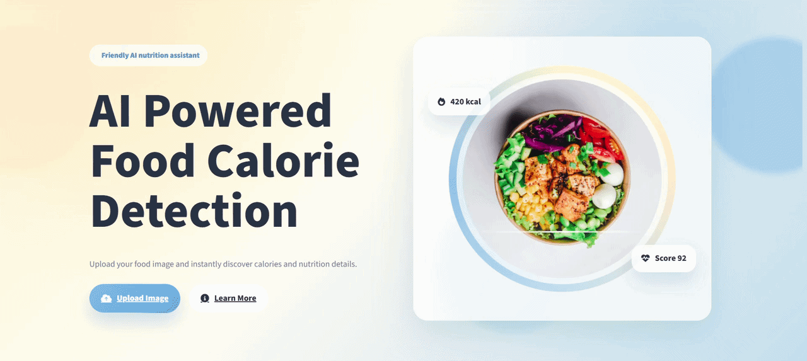

# CalCount AI - Food Calorie Detector

CalCount AI is an AI-powered food calorie detection web app. Users can upload a food image, and the system predicts the food item, estimates serving size, and displays nutrition details such as calories, protein, carbohydrates, fat, sugar, fiber, health score, and healthier recommendations.

The project is built mainly with Python using Streamlit for the interface, Bootstrap 5 and custom CSS for styling, and YOLO/Ultralytics models for food and serving-size prediction.

## Live Demo

The deployed version of CalCount AI is available at:

https://smrutirekha123-calcountai.hf.space/

## Preview

## Preview



## Features

- Upload a food image and analyze it instantly
- Predict food items using a YOLO model
- Estimate serving size using a separate serving-size model
- Show calories and nutrition values from a local nutrition dataset
- Display health score, category, advice, suggestions, and healthy alternatives
- Allow manual correction if the model prediction is not accurate
- Responsive interface with Streamlit, Bootstrap 5, and custom CSS
- Light and dark mode support
- Docker-ready deployment setup

## Tech Stack

| Layer | Technology |
| --- | --- |
| Frontend | Streamlit, Bootstrap 5, HTML, CSS |
| Backend Logic | Python |
| AI Model | YOLO / Ultralytics |
| Image Processing | Pillow, OpenCV |
| Dataset | CSV-based Indian food nutrition dataset |
| Deployment | Docker, Hugging Face Spaces compatible |

## Project Structure

```text
.
|-- Frontend/
|   |-- app.py
|   `-- assets/
|-- backend/
|   |-- health_score.py
|   |-- image_handler.py
|   |-- nutrition.py
|   `-- recommendation.py
|-- model/
|   |-- best.pt
|   |-- Serving_Size.pt
|   |-- predict.py
|   `-- preprocess.py
|-- Indian_food_nutritional_dataset/
|   `-- nutrition.csv
|-- Dockerfile
|-- requirements.txt
|-- start_yolo_app.bat
`-- README.md
```

## Installation

1. Clone the repository:

```bash
git clone https://github.com/smrutirekhaparida576/Group-Project-AIML-.git
cd Group-Project-AIML-
```

2. Create and activate a virtual environment:

```bash
python -m venv .venv
.venv\Scripts\activate
```

3. Install dependencies:

```bash
pip install -r requirements.txt
```

4. Create an environment file:

```bash
copy .env.example .env
```

5. Run the app:

```bash
python -m streamlit run Frontend/app.py
```

After starting the app, open:

```text
http://localhost:8501
```

## Environment Variables

The app uses these values from `.env`:

```text
FOOD_MODEL_PATH="model/best.pt"
SERVING_MODEL_PATH="model/Serving_Size.pt"
NUTRITION_DATASET_PATH="Indian_food_nutritional_dataset/nutrition.csv"
MIN_FOOD_CONFIDENCE="40"
```

Keep private values in `.env` and use `.env.example` only for shared configuration examples.

## Docker Deployment

Build the Docker image:

```bash
docker build -t calcount-ai .
```

Run the container:

```bash
docker run -p 7860:7860 calcount-ai
```

Then open:

```text
http://localhost:7860
```

## Model Details

This project uses two YOLO model files:

- `model/best.pt` for food item detection
- `model/Serving_Size.pt` for serving size estimation

The predicted food is matched with the local nutrition dataset to calculate nutrition values for the selected serving size.

## Dataset

Nutrition values are loaded from:

```text
Indian_food_nutritional_dataset/nutrition.csv
```

The dataset contains nutrition information for Indian food items and is used to calculate calories, protein, carbohydrates, fat, sugar, and fiber.

## Notes

- This app is designed for educational and project demonstration purposes.
- Predictions may vary depending on image clarity, food angle, lighting, and model confidence.
- Nutrition values are approximate and should not be treated as medical advice.
